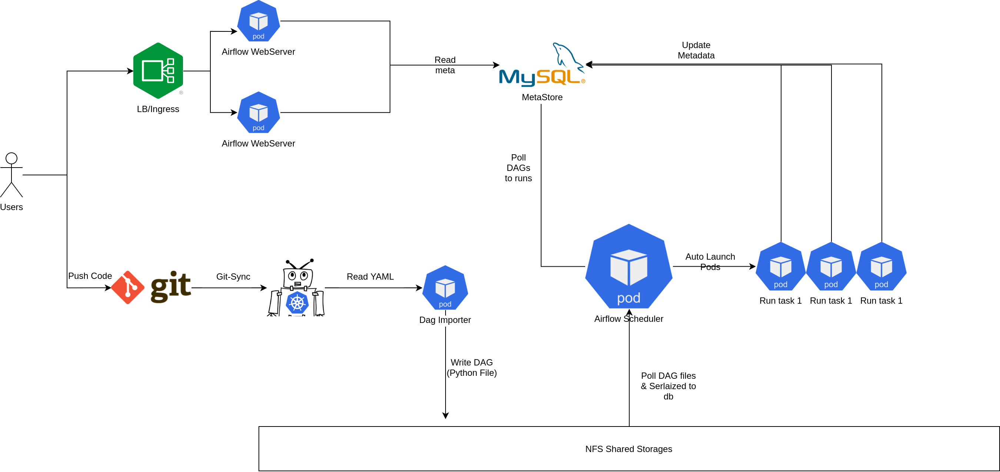

---
title: "Path to airflow 2"
date: 2021-08-20T18:09:24+07:00
publishdate: 2021-08-22
tags: ['airflow', 'data_infra', 'data_engineering']
resources:
- name: features
  src: images/feature-airflow_arch.png
---

*Airflow in the nut shell:*
- Một phiên bảo cron tab (chạy mỗi ngày, mỗi tuần, mỗi giờ mỗi tháng) với UI xịn xò.
- Các tín đồ data hay sử dụng để viết ETL (Extract Transform Load) job
    - Ví dụ như là select vào rows từ MySQL
    - Thêm ít gia vị (Cooking)
    - Load vào Datawarehouse

**Ké vài miếng quảng cáo**
- Bạn đang mong muốn tìm kiếm cơ hội mới
- Bạn muốn làm việc với những công nghệ big data tối tân nhất.
- Xài serveless tốn kém quá với chậm chạp, bạn có thể tự build & publish cho hơn 500 anh em TIKI xài.

Đến ngay với team data nhé: [JD đây nè](https://tuyendung.tiki.vn/job/senior-data-engineer-data-platform-2082)

# Mới vào nghề

Team Data Platform của Tiki sử dụng [Apache Airflow](https://airflow.apache.org/) từ những ngày đầu lập team từ năm 2017. Cho tới hôm nay kiến trúc & cách sử dụng airflow cũng thay đổi khá đáng kể. Bài viết này sẽ chia sẽ cách mà Team Data của dụng airflow, ưu nhược điểm của các cách dùng.

Ngày xửa ngày xưa.

Khi mình vào TIKI vào T9/2018, một lần được cho vào con airflow chính, một cách ngây thơ updates 1 packages.

```bash
# TLDR:
# virtualenv python 2 & airflow 1.8
pip install --upgrade pandas-gbq
supervisorctl restart all
exit
```

Sau đó tắt máy đi ngủ, tới chiều anh em ping nhau, Airflow ra đi rồi các bác ạ, Rì pọt ra đi hết rồi ông giáo ạ. Nghe xong tè ra quần luôn.

Mistakes:

- Không backup virtualenv trước khi run `pip install`

# Nông dân tập thành cloud

**1 năm sau (T9/2019)**

Thời điểm này TIKI migrate từ Data Center lên (GCP) Google Cloud Platform. Thế là phải chuẩn bị bưng hệ thống một lần nữa.

Ở thời điểm này có 3 con airflow đang chạy:

- 1 con chạy jobs ETL (Airflow 1.8)
- 1 con chạy sync snapshot từ MySQL/Postgres lên BigQuery (Airflow 1.8)

Nghĩ, giờ lên cloud mà xài công nghệ out date thì nông dân quá. Quyết tâm chơi lớn cài airflow latest luôn. DAG thì chắc chỉ cần copy qua là xong, không vỡ gì âu.

*Được cấp 1 con VM mới trên GCP & ssh vào pip install liền.*

Đang đợi thì tự tát cái bếp. Học Infras As Code các thứ rồi mà lại tay chân thế. Thế là ngồi viết ansible để cài airflow  =)). Pip install thì vài phút, ngồi viết mất vài tiếng.

Copy dag nào thì dags đó vỡ

- Phát hiện ra là import path & params đã thay đổi khá nhiều từ 1.8 lên 1.10. (Lúc này còn ngây thơ mà)
- Hành ngập mặt rồi, kiểu này migrate chắc tới tết, trong khi anh em lúc đó còn 15 ngày để cutdown.

Ngồi nghĩ nghĩ, mếu được, thế này sau này kiểu gì cũng sẽ gặp case tương tự.

***Lúc này sau 1 thời gian được rèn luyện ansible và tập làm văn kubernetes manifests bắt đầu có ý tưởng chế 1 yaml để viết config & build nó thành dag.***

[Xem bài viết nà](/posts/airflow-dags-the-right-way/)

*TLDR*:

- Mình viết thêm 1 lớp để set default (giá trị mặc định của các field), tên `Operator` ngắn gọn xúc tích thay vì phải import 1 path dài ngoằn.
- Tự động phân quyền cho dag, alert callback vào slack/telegram khi dag failed.
- Mỗi team có 1 folder riêng trong git hoặc thích thì cho hăn luôn 1 git repo riêng.

***Tiếp theo là giờ sẽ deploy ở đâu đây?***

Tuy là nông dân nhưng vẫn rất thích đú trend Cờ lâu nây típ (Cloud Native) thế là bắt tay vào nghiên cứu để chạy trên kubernetes luôn.

- CeleryExecutor: có sẵn helm chart airflow để cài. Tuy nhiên lại gặp vấn đề là chúng ta phải tạo trước workers & việc tự động scale cũng không dễ dàng gì.
- KubernetesExecutor: có thể tự động tạo `Pod` để run task mà không cần phải tạo worker trước. Nếu executor này kết với với `autoscaler` & Preemtible Pool của `gke` thì tuyệt vời ông mặt zời. Chốt nhanh chốt nhanh.

Nghiên cứu vài này thì cũng bắt đầu vào thiết kế & bắt tay vào viết k8s manifest.

Những tiêu chí khi deploy airflow trên k8s.

- Phải tiết kiệm: bằng cách tự scale node khi cần (điều này thì `autoscaler`của gke đã làm rất tốt.
- Một cách khác mình nghĩ tới là sử dụng [Preemptible VM](https://cloud.google.com/preemptible-vms) của GCP: Với loại VM này thì thời gian tối đa của là 24h sau khi được tạo. Google có thể lấy lại (reclaim) bất kì thời điểm nào.

Với những yêu cầu như trên thì mình thiết kế các deployment riêng như sau:

- Scheduler: Core của toàn hệ thống nên phải cực kì stable, nên mình quyết định chọn node standard. (Core chết thì cậu vàng cũng phải bán đi mới mua bánh mì ăn được).
- Webserver thành 1 deployment riêng (run trên preemtible pool) để tiết kiệm và để HA thì mình tăng ≥ 2 replicas + `podAntiAffinity` topology là [`kubernetes.io/hostname`](http://kubernetes.io/hostname).
- Pod được tạo ra từ airflow scheduler mình set mặc định chạy qua preemtible pool (tiết kiếm tiền để mua bánh mì) & tất nhiên là có `hidden option` để select node khác khi cần.

Về docker image: Thời điểm này airflow chưa có official image và community docker vẫn còn thiếu nhiều thứ. Mình quyết định viết riêng 1 dockerfile & đưa vào những dependencies cần thiết đủ để airflow chạy được.

Sau khi đủ các nguyên vật liệu thì bắt đầu lên đồ thôi.



Ngoài cách deploy airflow thì còn những bài toán sau cần giải quyết

**Cost Saving vs Stable**

- Để đảm bảo task chạy ổn định trên Preemtible VM, cần phải bật auto retry cho toàn dag trên hệ thống (việc này cực kì đơn giản nhờ vào config engine).

**Lưu file yaml ở đâu?**

- Việc sử dụng 1 file config riêng, mình hoàn toàn có thể support một giao diện để viết config hoặc fancy hơn là kéo thả.
- Nhưng nghĩ đi nghĩ lại thì build 1 UI như vậy khá tốn thời gian & lại phát sinh thêm phải handle conflict khi nhiều người cùng sửa 1 dag.
- Vì vậy mình đã force mọi người dùng **Git**. Code yaml sẽ được sync vào deployment `Dag Importer`, ở đây yaml sẽ được validate & convert thành python DAG file. Sau khi có file DAG, tới vấn đề tiếp theo.

**Lưu dag ở đâu?**

- Lưu thẳng trong images: có nhược điểm là phải build image liên tục khi có thay đổi → Khó optimize được Pod startup time do phải check Pull Image. Build docker có 1 nhược điểm là khá chậm.
- Lưu ở Shared Stores: Hiện gại Persistent Disk của gke chưa support `Read Write Many` , điều này dẫn đến phải sử dụng NFS. IOPS của NFS cực kỳ thấp so với SSD.
- Việc chọn storage nào phụ thuộc rất nhiều vào kiến trúc của airflow: Sau khi nghiên cứu 1 hồi thì mình nhận thấy là airflow sẽ serialized dag vào database, webserver & các worker đều đọc từ database này.

⇒ Vì vậy mình chọn shared storages: không ảnh hưởng nhiều tới thời gian chạy task, 1 ưu điểm nữa là nó đơn giản hơn architect của hệ thống.

**Logging như thế nào?**

- Khi lên kubernetes option bắt buộc là phải chọn 1 remote logging (cụ thể thì mình chọn gcs để lưu)
- Nhưng remote logging gặp phải vấn đề là không xem được lúc task đang chạy.
- Dẫn đến mình phải workaround bằng cách sử dụng 1 file system tạm để lưu logs của task đang chạy. Còn đuờng nào ngoài NFS nữa đâu.

**Authentication & Authorization**

- Mình định hướng build Airflow trở thành 1 open platform, mọi người đều có thể viết config & chạy. Đối với định hướng như vậy, bắt buộc phải phân quyền thật kỹ & tốt nhất là ở DAG level.
- Cũng khá may là airflow support Oauth2 & cả access ở DAG level.
- Việc này trở nên khá đơn giản khi mà config system đã add sẵn DAG vào mỗi role.

**Monitor & Alerting**

- Với hệ thống config thì mình đã tự động gắn sẵn **task_failed_callback.** Mỗi team sẽ đuợc tạo 1 connection riêng (có thể là slack/telegram) & lúc failed thì dag nhà ai nấy nhận & tự đi check.
- Đối với airflow thì mình sử dụng  [Statsd Exporter](https://github.com/prometheus/statsd_exporter) để expose metrics API cho prometheus và lên grafana tạo dashboard/alert.

**Backfill dags như thế nào?**

- Ngày trước cái trên VM thì hay ssh vào server để chạy airflow backfill.
- Còn trên k8s thì ssh đâu mà vào. Vào pod để execute thì nó lại bị limit ở vài bạn engineer.
- Vì vậy mình đã custom lại 1 opensource là [airflow-backfill-util](https://github.com/AnkurChoraywal/airflow-backfill-util) & share quyền cho mọi người vào backfill.

***Vài cảm nhận:***

- NFS everywhere.
- Nói là Preemtible VM nhưng mình cảm nhận là khá là stable, sau 2 năm sử dụng thì mình chưa gặp vấn đề gì quá lớn (Có thể do thiết kế system pro quá nên không bị lỗi :">)
    - Lâu lâu có vài task chạy hơn 5h bị down, đối với những task này, mình question ngược lại tại sao nó lại chạy lâu thế →optimize DAG.
    - Đối với Data Scientist Team: Mình white list cho viết hẵn Python code luôn, cho select node xịn để chạy. Chớ model train cũng hết nữa ngày.
- Khi chạy airflow trên K8S thì Airflow không còn đơn thuần là chỉ ETL nữa, mà có thể chạy mọi thứ, thanks [KubernetesPodOperator](https://airflow.apache.org/docs/apache-airflow-providers-cncf-kubernetes/stable/operators.html).
    - Hiện tại mình luôn khuyến khích các bạn Data Scientist thay vì viết `PythonOperator` & nhờ mình cài thêm dependencies vào base image, thì viết một Dockerfile chứ mọi thứ cần thiết ở trong đó (ML Libs, C++ Libs, Code ...) & config [KubernetesPodOperator](https://airflow.apache.org/docs/apache-airflow-providers-cncf-kubernetes/stable/operators.html).
    - Việc này vừa đảm bảo tính ổn định, không cần phải add những thứ không cần thiết vào base images sẽ tốn time để pull → giảm startup time.

# **Airflow 2**

Version 2.0 được release vào ngày  [2020-12-18](https://airflow.apache.org/docs/apache-airflow/stable/changelog.html#airflow-2-0-0-2020-12-18) thế nhưng mình chưa dám update ngay, vì trước giờ mỗi lần chỉ update patch version của airflow không què chổ này thì chổ kia. Mà lỗi gặp nhiều nhất vẫn là google oauth2, và phần lớn là do lỗi depedencies 😐.

Sau hơn 8h tháng delay thì quyết tâm làm 1 lần sau cuối.

Lên danh sách những việc cần làm:

- Coi ngày: chọn ngày tốt mới dám upgrade (check xemngay.com)
- Làm theo upgrade guides: [https://airflow.apache.org/docs/apache-airflow/stable/upgrading-to-2.html](https://airflow.apache.org/docs/apache-airflow/stable/upgrading-to-2.html)
    - Lên airflow 1.10.15
    - Install backport provider & update module_path vào cái operators (đơn giản là update vào config của operator alias).
    - Generate pod_template_file
    - Run airflow upgrade_check & fix. Đa số lỗi mình gặp đến từ các DAG viết bằng python của team Data Scientist. Không còn cách nào khác là phải đi fix tay từng dag, cũng rất may là khoảng chưa tới 20 dags.

Sau khi lên bridges & chọn đuợc ngày lành tháng tốt. Bắt đầu upgrade airflow 2. Ở tiki thì đa số DAG được chạy vào ban đêm & buổi sáng. Riêng buổi chiều & tối thì rất ít. Thời điểm vàng là đây.

- Backup Metadata DB: Viết tâm thư gửi anh em system để lỡ mà sự việc không thành, vẫn còn đừong quay về nhà.
- Scale Down tất cả services: `Scheduler`, `WebServer`, `ImportDags`
- Merge Pull Request để Build & Deploy.
- Start 1 replica WebServer, execute bash & run: `airflow db upgrade` vừa ngồi vừa nghe nhạc để tự trấn an mình =)), chớ lúc đó cũng teo hết mọi thứ rồi.
- Đợi khoàng 30 phút thì migrate run xong. Mình bắt đầu lên web ui để kiểm tra xem có bị vỡ gì không. Thấy mọi thứ có vẻ ổn.
- Scale scheduler lên 1 replica. Thấy DAG mếu chạy, bắt đầu xanh cmn mặt.
    - Không run được do entrypoint trong docker đã đuợc add sẵn `airflow`  command. Sau đó `args` lại add thêm `airflow` nữa.

- Sau khi fix lỗi command thì thấy DAG bắt đầu chạy: đi kiểm tra một vòng thì đa số DAG chạy ok, có một số lỗi vặt khá dị:
    - `env_vars` của KubernetesPodOperator tự động nhận diện cái env bắt đầu bằng `/` thành template file → dẫn đến start pod lỗi.
    - Bug nhọ nhất là admin không được edit user permissions nữa. Phải ngồi đợi bản fix tiếp theo thôi.
    - Logging: Không còn sử dụng connection_id để lấy logging credention cho gcs mà phải mount credential vào pod.
    - Một vài lỗi nhỏ khác do sử dụng internal function của airflow.

***Vài cảm nhận về Airflow 2:***

- Performance tăng khủng khiếp: Khi số lựợng DAG tăng lên từ vài trăm lên gần 2000, một vấn đề rất lớn gặp phải đối với airflow 1 là thời gian delay giữa các task trong dag rất lớn. Phải mất từ 5 - 15p giữa các task & thời gian start DAG delay khoàng 5 phút so với giờ được set. Khi lên version 2 thì gần như về 0. Điều này cực kỳ có ý nghĩa đối với những task chạy mỗi 1 hoặc 2 phút.
- UI mới nhìn đẹp hơn hẵn & thực tế là ai cũng khen (chê xấu là disable account nhé).
- Việc upgrade lần này êm hơn hẵn so với dự tính của mình là có thể không lên được
    - Vì mình thấy được qua các lần upgrade trước, vỡ rất nhiều chổ


# Kết luận
Còn chờ đợi gì mà không lên airflow 2 ngay và thôi.
Mình đã upgrade thành công bạn cũng thế. Và nhớ coi ngày trước khi upgrade nha.


**Ở trên có quảng cáo rồi, nhưng mình vẫn cứ đăng lại**
- Bạn đang mong muốn tìm kiếm cơ hội mới
- Bạn muốn làm việc với những công nghệ big data tối tân nhất.
- Xài serveless tốn kém quá với chậm chạp, bạn có thể tự build & publish cho hơn 500 anh em TIKI xài.

Đến ngay với team data nhé: [JD đây nè](https://tuyendung.tiki.vn/job/senior-data-engineer-data-platform-2082)