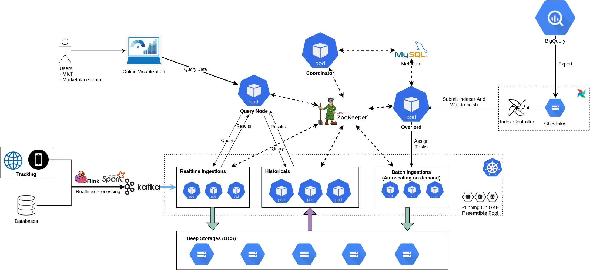
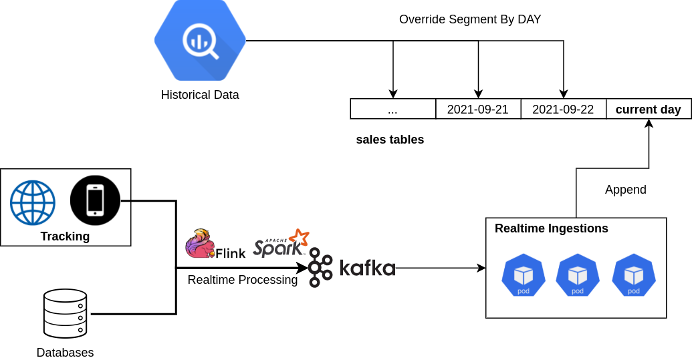

# Introduction

## Tại sao phải build hệ thống data phục vụ visualization ?

Vào đầu năm 2019, khi mà anh em bắt đầu mệt mỏi với backlogs dài hơn cầu Sài Gòn chỉ để viết SQL & làm report Google Sheet thần thánh và Google Data Studio (để build dashboard report).

Lúc mà hiệu suất của anh em chậm lại đáng kể bởi:

- Việc build report bằng Google Sheet đa số là viết 1 câu SQL vài trăm dòng, lấy dữ liệu từ các bảng raw (dữ liệu thô) & từ vài chục GB đến trăm GB data (với chi phí hơn 5$ để xử lý 1TB data), cực kì không hiệu quả.
- Để làm report trên Data Studio hiệu quả cần phải tối ưu khá nhiều thứ, ví dụ như thay vì dùng câu view thì phải build ra các bảng trước (materialized view). Nếu không cẩn thận thì tiền mất trong chốc lát là điều khó tránh khỏi.
- Chậm trễ báo cáo ảnh hưởng đến quyết định quyết định đúng đắn cho anh em business do không đủ dữ liệu.

Về mặt dữ liệu còn gặp phải vấn đề:

- Cập nhật theo ngày, hoặc một số nhỏ hơn thì theo giờ: Việc không hổ trợ dữ liệu real-time sẽ ảnh hưởng nhiều đến vận hành, phân bổ về inventory hay là boosting các sản phẩm HOT vào những đợt sales lớn (ví dụ như 9.9, 10.10 ...).

Những lý do trên thôi thúc anh em Team Data bắt đầu suy nghĩ tìm cách để tối ưu hóa hiệu suất cũng nhưng nâng cao hiệu quả sử dụng dữ liệu ở TIKI, với yêu cầu đặt ra về hệ thống này:

- Anh chị em Business (như team Marketing, ngành hàng, marketplace ...) có thể phân tích một cách nhanh chóng, hiệu quả & đưa ra các quyết định đúng đắn. Đồng thời có thể tự tạo các dashboard chỉ bằng kéo thả, không cần phải mở tickets & đợi anh em data gửi data.
- Các bạn analytics (DA), BI có thể tự viết cho mình một data pipeline, đưa lên hệ thống visualization một cách đơn giản nhất.
- Anh em data platform tâp trung vào build hạ tầng (Data Infrastructures) & các công cụ (tools) để tổng hợp, tổ chức & xử lý data một cách nhanh chóng hiệu quả, đơn giản nhất có thể. Với nền tảng đó, các teams & phòng ban khác ở TIKI thực hiện những phân tích cần thiết & đưa ra những quyết định đúng đắn mà không phải tốn quá nhiều công sức hay phải dành nhiều thời gian để tìm hiểu quá sâu về mặt kỹ thuật (technicals).
- Dữ liêu phải được cập nhật real-time: ví dụ như khách hàng đặt đơn hàng thành công, thì đơn hàng đó ngay lập tức phải xuất hiện ngay lập tức hệ thống.
- Đáp ứng những yêu cầu về mặt hạ tầng (scalable, stable): hệ thống vẫn phải ổn định & nhanh với lượng dữ liệu to dần (từ vài trăm GB lên cỡ TB) hay thậm chí có thể lên Petabytes trong tương lai.
- Có thể mở ra một hướng mới để lấy dữ liệu cho các service khác ở TIKI

Cụ thể hơn, hệ thống hiện tại sẽ giải quyết vấn đề Data Visualization & Data Sharing trong ảnh dưới đây.


*(Nguồn: Semantix - semantix.com.br)*



# Nghiên cứu & lựa chọn công nghệ

## Intro

Với những yêu cầu đã đặt ra, team bắt đầu tiến hành tìm kiếm & xâu dựng kiến trúc để giải quyết bài toán trên.

Trước tiên cần phải viết chi tiết hơn về mặt technical, hệ thống cần phải đáp ứng được:

- Hệ thống này ổn định (stable & reliable), phải nhanh (fast).
- Tích hợp được với hệ thống data warehouse hiện tại.
    - TIKI chọn BigQuery cho Data-Warehouse platform, vì vậy bắt buộc phải đồng bộ (sync) dữ liệu từ BigQuery
- Có thể backfill historical: ví dụ khi thêm column mới có thể run lại data quá khứ mà không tốn quá nhiều công sức.
- Hổ trợ data real-time, đặc biệt là từ Apache Kafka.
- Scalable: Dữ liệu growth từ GB lên TB hoặc vài chục TB vẫn phải đáp ứng được.
- Tiết kiệm: (+ auto scaling) có thể thêm servers khi cần thiết & giảm xuống khi thấp điểm.
- Không phải tốn quá nhiều nhân lực để quản lý & vận hành.

Sau thời gian tìm hiểu, cài đặt & thử nghiệm các công nghệ database khác nhau, từ Apache Druid, Apache Pinot, ClickHouse. Một vấn đề phải đối mặt đó là những bài so sánh về ưu nhược điểm của các database trên là khá ít. Và team cũng xác định chiến lược lúc này vẫn là thử sai và thay đổi càng nhanh càng tốt để tìm ra được công nghệ phù hợp với yêu cầu của team.

Sau một thời gian thử nghiệm, team đã quyết định chọn Apache Druid là thử nghiệm đầu tiên cho hệ thống của mình.

## Apache Druid's coming

### What is Druid ?

> Apache Druid is a database that is most often used for powering use cases where real-time ingest, fast query performance, and high uptime are important. As such, Druid is commonly used for powering GUIs of analytical applications, or as a backend for highly-concurrent APIs that need fast aggregations. Druid works best with event-oriented data.  -  [https://druid.apache.org/](https://druid.apache.org/)

*Hiểu đơn giản thì:*

> Apache Druid là cơ sở dữ liệu (có thể hình dung như Google Sheet hoặc như MySQL) được sử dụng vào những yêu cầu về dữ liệu real-time, query với tốc độ chóng mặt & đảm bảo hệ thống luôn có thể đáp ứng được tính toán (uptime).

### Hiện tại TIKI đã sử dụng Druid cho những bài toán nào?

**Business intelligence / OLAP**

Druid là trái tim trong hệ thống OLAP của TIKI, toàn bộ dữ liệu về Sales (in real-time), sellers, metrics liên quan tới sản phẩm đều đã sẵn sàng để phục vụ tối đa nhu cầu của anh em business.

**Clickstream analytics (web and mobile analytics)**

Đây có thể nói là lượng data khủng nhất từ trước đến giờ. Toàn bộ các hoạt động của khách hàng trên Tiki Web/App đều được track & gửi về hệ thống tracking: từ clicks, impressions, hoạt động view pages, add to card ..

Team đã làm một data pipeline để tính toán lại gần như tất cả logic từ Google Analytics: như sessions, attributions models, users ... Tổng hợp thêm các dữ liệu về Sales để tạo ra 1 data source duy nhất có thể đáp ứng được nhu cầu của business.

**Risk/fraud analysis:**

Khi có toàn bộ dữ liệu về sales, users behaviors thì việc tìm insights cho các hành vi fraud đơn giản hơn bao giờ hết.

**Application performance metrics**

Để optimize về hiệu năng của web, app: anh em frontend & mobile đã gửi các metrics ví dụ như startup time, load pages ... thông qua hệ thống tracking rồi tới Druid để monitor in realtime & alert khi có vấn đề xảy ra.

# Team đã vận hành Druid như thế nào?



*Kiến trúc tổng thể của Druid trong TIKI Data Platform*

## Đồng bộ dữ liệu từ BigQuery

Druid được thiết kế để có thể tận dụng được hệ thống data platform (cả data warehouse) sẵn có, ví như như Hadoop, Hive, Spark, vì vậy rất nhiều cách đồng bộ dữ liệu (mình sẽ gọi là index) được hổ trợ. Tuy nhiên lại không có BigQuery trong danh sách.

Tuy không hổ trợc trực tiếp BigQuery, nhưng Druid có hổ trợ đọc file từ Google Cloud Storage - GCS qua `native batch indexer`.  Và mảnh ghép còn lại chính là từ BigQuery qua GCS (đã được BigQuery hổ trợ sẵn). 

Điều kiện cần đã xong, tiếp theo mà make it done. Nhiệm vụ chính bây giờ là viết một Airflow Operator (Có thể tham khảm cách team sử dụng Airflow ở đây nè: [https://www.hienph.dev/posts/airflow-dags-the-right-way/](https://www.hienph.dev/posts/airflow-dags-the-right-way/))

Để đảm bảo tiêu chí dễ sử dụng & hiệu quả khi đồng bộ, thì càng ít fields bắt buộc càng tốt và operator phải làm tốt nhất có thể để quá trình index càng nhanh càng tốt.

Hello `BigQueryTableToOLAPOperator`

```yaml
operator: BigQueryTableToOLAPOperator
table: tiktok_clone.girls_available
druid_destination_table: girls_available
```

## Data Modeling cho realtime & batch processing

Druid tổ chức dữ liệu thành các segment, được chia theo time (có thể theo giờ hoặc ngày). Và Druid hổ trợ sẵn tính năng override dữ liệu theo **time**. Tại sao điều này lại liên quan tới cách tổ chức dữ liệu.

Hình dung bạn có 1 data pipeline batch processing tính toán các report về Sales cực kỳ phức tạp, phải join hàng chục bảng với nhau, vài nghìn dòng SQL transform tất cả & rất khó để tính toán chính xác real-time được.

Vì vậy lúc thiết kế real-time processing, bạn chọn toán cách gần đúng (90 - 95%) bù lại độ phức tạp về giảm logic giảm 50%. Để launch data source mới này, bạn chọn cách tạo ra 2 bảng riêng cho realtime & batch, với 1 notes: *dữ liệu bảng realtime chỉ xài được trong ngày thôi.* Và sau đó cứ vài ngày lại có ticket về mis match data do nhầm lẫn realtime & batch. Can we do this better?

***Hello Lambda architecture***



Trên 1 cùng bảng (data-source của druid):

- Dữ liệu current day (real-time) sẽ được ingest trực tiếp từ Kafka
- Và vào ngày hôm sau, batch processing từ BigQuery sẽ override lại phần data đã được xử lý realtime.

Từ bây giờ, users chỉ biết đến 1 source duy nhất, không cần phải quan tâm bảng nào là dữ liệu history, phần nào là của real-time.

## Scale & Optimization

### Phiên bản đầu tiên

Khi đã xác định chiến lược chính khi nghiên cứu Druid là thử sai càng nhanh càng tốt.

Bắt đầu khiêm tốt chỉ với 3 em VM (8cores mỗi em thôi), và kiến trúc microservice của Druid bắt buộc phải có: ZooKeeper,  Coordinator, Overlord, Historical, Broker, Middlemanager. Cài đặt tay chân là điều không thể, nhất là khi mà số lượng nodes lên hàng chục thậm chí là hàng trăm. Thế là được gặp thêm anh bạn Ansible.

*Phiên bản production được hòa thiện và giới thiệu đến anh em business vào khoảng tháng 03/2019, chủ yếu phục các report về sales, thời điểm này chưa tới 50GB, anh em business kéo phát nào là ra số được phát đó. Êm lắm anh em <3.*

### Thử thách về scale

Sau khi giới thiệu hệ thống olap cho các team khác, dữ liệu trong hệ thống bắt đầu mở rộng sang marketing (report về sessions, users, revenue cho các channel marketing), report về sellers, các dữ liệu về deal .... Từ vài chục GB đã lên con số hàng trăm GB.

Đợt đó là event TIKI Giựt Cô Hồn T08/2019, trăm anh em vào soi số trên hệ thống olap, và việc gì tới cũng tới. Toang hết cả làng anh em ạ.

Sau đó mới phải xin thêm 3 con VM nữa, lại cặm cụi Ansible. Sau gần 3h thì hệ thống bắt đầu êm lai. 500 anh em tiếp tục soi số.  

> *Cho đến 2 đợt event tiếp theo: 09/09/2019 & 10/10/2019, mỗi lần như vậy đều phải request thêm server để đủ đáp ứng được nhu cầu. Mỗi lần thêm như bật bắt buộc team phải tạo node mới, sau đó boostrap các packages cần thiết, cái java & cuối cùng là druid. Tốn cơm quá nhiều.*

Sau khi trải qua nhiều lần phải tay chân để đáp ứng được nhu cầu sử dụng dữ liệu ngày càng nhiều của anh em business. Cần phải có một giải pháp khác để có thể scale nhanh hơn & không tốn nhiều công sức nữa.

### Kubernetes's coming

Nghe đâu có có tiếng gọi của Apache Airflow (Nickname ở Tiki là Airlock) từ trên Kubernetes vọng xuống.

> Lên k8s đi, bấm bấm vài nút là có ngay cây tre **trăm nodes rồi.**

Bài đó ở đây nè: [https://www.hienph.dev/posts/apache-airflow/](https://www.hienph.dev/posts/apache-airflow/)

Bắt đầu research tìm kiếm tài liệu về cách deploy Apache Druid trên k8s. Duy nhất tìm được 1 template Helm chart. Cơ mà lại outdate version. Với sử dụng helm 2 phát sinh vấn đề về security và phải xin thêm quyền. Lại ngồi tập làm văn kubernetes manifests.

Trước khi đưa hệ thống lên k8s, team phải cân nhắc các tiêu chí để đảm bảo scale dễ dàng:

- Làm sao có thể chia thành nhiều tier (group) được: ví dụ data về sales sẽ được đặt vào 1 nhóm server ổn định, nhiều resources hơn. Data về tracking rất bự, cần phải chia thành hot & cold tier. Data còn lại cho vào 1 tier khác để không bị ảnh hưởng lẫn nhau.
- Rẻ nhất có thể: Phải run được trên Preemtible Nodes (Preemtible tiết kiệm 80% so với những node thông thường & điểm đặc trưng mà thời gian tối đa từ lúc được tạo là 24h, có thể bị down bất kì thời điểm nào), xem thêm [Preemptible Virtual Machines](https://cloud.google.com/preemptible-vms)
- Batch indexer có thể auto scale khi có nhu cầu về backfill dữ liệu quá khứ hoặc là những giờ cao điểm. Còn lại scale down để tiết kiệm chi phí.

Với những yêu cầu như vậy mình đã tổ chức các components như sau:


*Tiki's Architecture for Apache Druid*

Việc tiếp theo là viết k8s manifest & sẵn sàng cho quá trình migrations.

**Migrate từ VM lên Kubernetes.**

Để hạn chế downtime đến mức tối thiểu thì Broker & Historical vẫn running chỉ shutdown các components còn lại.

Tiến hành apply manifest và set giá trị `replica = 0`. Lần lượt start các services: ZooKeeper, Coordinator, Historical, Broker. Kiểm tra Historical pull data từ deep storage. Sau khi đảm bảo toàn bộ table đã 100% available, tiến hành đổi endpoint qua cụm druid mới.

Và cuối cùng là hoàn tất các component còn lại: Overlord, Batch Indexer & Realtime Indexer.

### Tuning & Optimize cho Druid

**Bật cached ở historical**

Để tăng tốc query thì mình sử dụng memcached ( 3 nodes + facebook mcrouter để scale & shard memcached) ở Historical. (Bật cache ở broker có thể dẫn đến lệch data đó nhé, cẩn thận)

**Tận dụng RAM tối đa cho druid**

Druid sử dụng page cache để optimize việc read segment từ disk. Vì vậy, càng nhiều RAM trống, càng tối ưu cho page cache.

**Druid Configs**

Để đảm bảo hệ thống luôn đáp ứng được hiệu năng khi lượng dữ liệu tăng lên, team định kỳ sẽ tuning lại cái config dựa theo các guidelines của Druid. Và hiện tại một vài config team nhận thấy ảnh hưởng nhiều đến hiệu năng nhất như `size of buffers`, `processing threads`, `memory allocated to query caches` .

**Multi-Tenant & Auto Scaling**

- Middle Managers: chia thành 2 category batch & realtime. Mình bật HPA (horizontal pod autoscaler) cho batch indexer (theo memory metrics)
- Historicals: mình chia thành 2 nhóm (tier) & số lượng replicas theo nhu cầu của bussiness
    - core: chứa data về sales
    - default: tất cả data còn lại, là tier bự nhất chiếm hơn 80% size của cluster.

Bật HPA cho historical chưa thấy hiệu quả. Vì vậy, giải pháp scale vẫn là dựa vào kinh nghiệm & chủ động tăng resources vào những đợt campaign.

### **Monitor**

Để tích hợp dễ dàng với k8s của TIKI, team chọn cách đẩy metrics qua statsd & sử dụng statsd-exporter để expose sang prometheus & tạo chart, alert trên grafana.

Khi run trên k8s, việc upgrade đơn giản hơn bao giờ hết, chỉ cần build Docker image tương ứng với version mới, update image và đợi quá trình rolling upgrade done.

Một điều mình rất thích ở druid là toàn bộ data được lưu trữ ở deep storage (hiện tại đang sử dụng gcs), nên việc migrate hệ thống cực kỳ đơn giản, không lo lắng mất mát dữ liệu.

Ở thời điểm hiện tại có thể nói Druid đã ổn định và đáp ứng được nhu cầu đặt ra. Nhờ vào hệ thống self-healing, việc sử dụng Preemtible Pool cho historicals & brokers không ảnh hưởng quá nhiều đến data & performance. 

# Kết luận

Sau quá trình dài đằng đẵng tối ưu hệ thống để có thể phục vụ business của TIKI, Druid đã chứng tỏ được giá trị của mình khi đã đáp ứng được nhu cầu về xử lý dữ liệu lớn trong thời gian ngắn.

Hệ thống hoạt động ổn định, tuy nhiên vẫn còn nhiều thứ phải tối ưu, đặc biệt là disk usages, hiện tại billing disk đã gấp 1.5 lần CPU + Memory cộng lại.

Và ngoài ra, những phân tích chuyên sâu hơn về customers như Funnel, Retention hay Segmetation vẫn đang là thách thức lớn đối với hệ thống OLAP hiện tại.

Một vài metrics về hệ thống vào đợt campaign 8/8/2021 hệ thống ghi nhận được lượng events ingestions lên đến **100 k/s events.** 

Và mỗi ngày hơn **650 vCPUs** xử lý gần **13TB (26TB replicated)** data với hơn **65 tỉ rows** & phục vụ nhu cầu của toàn thể Business ở TIKI.

Qua những chia sẻ về quá trình thử nghiệm & scale Druid cho các bài toàn về phân tích dữ liệu ở TIKI, hy vọng các bạn có thể tìm thấy lời giải cho bài toán đang gặp phải.



